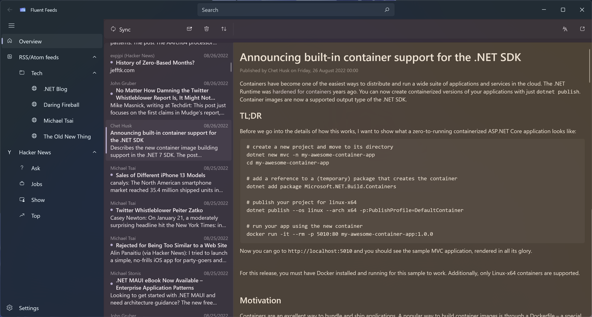

# Project Structure

This document provides a brief overview over the project structure and app architecture.

## Projects

The solution contains the following projects (excluding test projects) which are named after their root namespaces:
 * `FluentFeeds.Common` contains common data structures and helpers shared across all projects.
 * `FluentFeeds.Documents` contains the API for a rich text object model which can be created from and converted to a
   variety of different formats (Plain Text, HTML and a custom JSON description).
 * `FluentFeeds.Feeds.Base` contains the base classes required to create implement new feed provider (see
   [Feed Architecture]() for more info).
 * `FluentFeeds.Feeds.Syndication` contains the syndication feed provider used for RSS and Atom feeds.
 * `FluentFeeds.Feeds.HackerNews` contains the Hacker News feed provider.
 * `FluentFeeds.App.Shared` contains app-specific data structures and logic that can be shared across platforms.
 * `FluentFeeds.App.WinUI` contains the main app using WinUI 3 to implement the UI.

## App architecture

The application uses MVVM as its architecture. All view models should be platform-independent and testable. View models
can depend on different services. These services define interfaces and some of them also provide a platform-independent
default implementation, allowing the unit tests to inject mock service implementations when testing components.

Each view implemented in the framework-specific project should have a view model associated with it providing the data
and access to the business logic. Re-usable framework-specific views are implemented in the `Controls` directory.

Views and view models can be separated into three groups which are also reflected by the directory structure:

 * `Pages` are the entry-points in the App UI which are sometimes nested. The view models in this group are registered
   as transient services in the MVVM toolkit's IoC container.
 * `Modals` are views presented as dialogs or flyouts. They can be presented using the "modal service" and their view
   models are typically created in the view model or service launching the modal.
 * `ListItems` are views displayed in a list inside a different view. Their view models are created in the parent view
   model.

## Page structure

Pages can be nested - in WinUI this is achieved by embedding a `Frame` control which also handles navigation. The
currently visible page is defined in the view model as a "navigation route" structure which also contains navigation
parameters.

The app is currently divided into the following pages:

*blue: main, red: feed, yellow: item*
