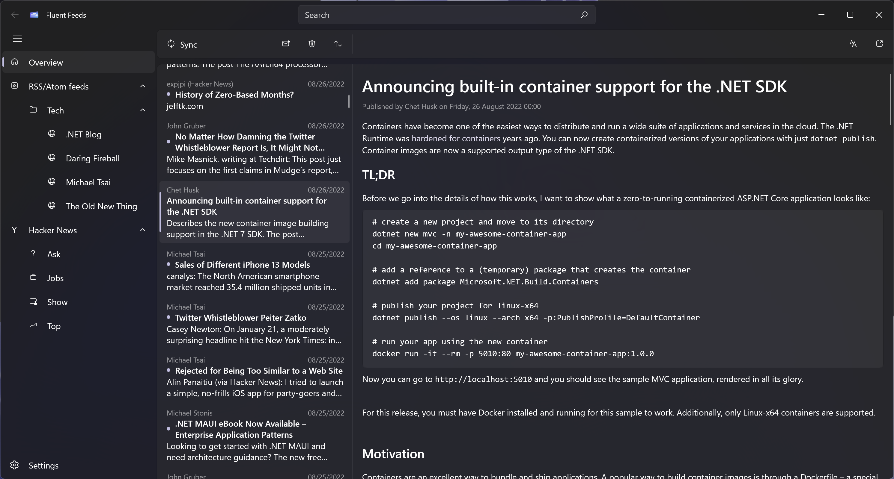

# Fluent Feeds

> Simple feed reader for Windows 11.

## Goals

Fluent Feeds aims to be a simple, modern and native feed reader app for Windows 11 that fits into the rest of the
platform.

It is designed to be modular by providing abstractions for feeds and items and using standard "feed providers" which
can load these feeds and items.

## Supported feeds

Right now, the app includes the following feed providers:
 * The **Syndication** feed provider which can load items from RSS or Atom feeds using the .NET
   `System.ServiceModel.Syndication` APIs.
 * The **Hacker News** feed provider which uses both the official API and the Algolia API to fetch stories and comments
   from Hacker News.

Support for dynamically loading custom feed providers using a plugin system is also planned. 

## License

This project is licensed under the MIT License - see the [license.txt](license.txt) file for details.
